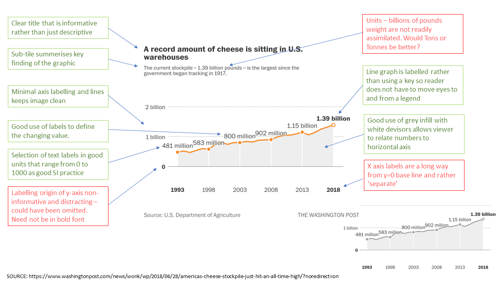
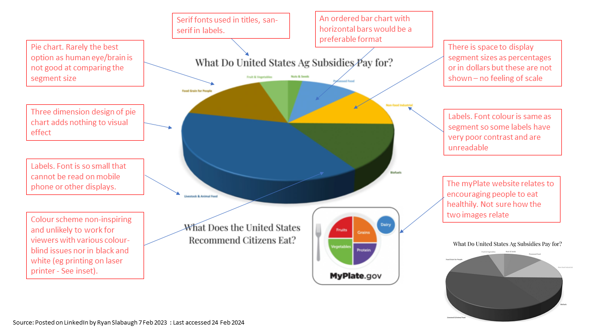

```{r setup, include=FALSE}
knitr::opts_chunk$set(echo = TRUE)

#. Version as at: 2023-02-26 1211"

# set up libraries required installing them first if need be. - do I need all of these 
if(!require("tidyverse")) install.packages("tidyverse")
if(!require("plotly")) install.packages("plotly")
if(!require("spData")) install.packages("spData")
if(!require("gifski")) install.packages("gifski")
if(!require("cowplot")) install.packages("cowplot") # needed for plot grid
if(!require("sf")) install.packages("sf") # needed for graticules 
if(!require("gt")) install.packages("gt") # for dictinary tables 

library(tigris)
library(maps)
library(spData)
library(tmap)

# useful link for using Tmap 
# https://jamescheshire.github.io/learningR/mapping-point-data-in-r.html#proportional-symbols
# author is Professor of Geographic Information and Cartography at University College London

# clear out any current variables etc
rm(list = ls())

```
# Background

The data sets supplied refer to milk production and consumption in the USA over the past 20 - 30 years. Background press articles have been supplied at: 

https://www.npr.org/2019/01/09/683339929/nobody-is-moving-our-cheese-american-surplus-reaches-record-high 

and 

https://www.washingtonpost.com/news/wonk/wp/2018/06/28/americas-cheese-stockpile-just-hit-an-all-time-high/?noredirect=on

## Observations

- The theme of both articles was that there is a growing milk/cheese surplus with the Washington Post reported the stockpile had grown from 481 million in 1993 to 1390 billion pounds in 2018. They considered this was due to increasing production and a falling consumer demand for milk and cheese. Milk does not store well so any surplus is made into cheese for storage and export. About 14% of national milk production is exported but trade issues with Mexico, China and elsewhere may limit future export potential. As stockpiles grow and stores fill there is pressure not to make cheese and so cheese and thus milk prices fall. 

## Objectives 

This report will use a range of graphical techniques from base-R and ggplot2 to create static and dynamic graphs and charts to investigate these data sources. Some of the dynamic charts will be rendered in GIF files that can be found on the GitHub repo and a Flexdashboard will be presented in a seperate R file for running. 

# Data 

The databases on the TidyTuesday source are historic and only run up to 2017. The GitHub readme document gives the source of the data (USDA databases) and, where possible, the original data has been updated to include more recent years. The USDA datasets were available as Excel files but these were heavily formatted with column merges, repeated rows etc. Excel was used to convert the data into Tidy format with a Dictionary. The Excel and associated csv files are stored on the GitHub repo. 


```{r load data, message=FALSE, warning=FALSE, include=FALSE}

setwd("C:/ATC_data/Harper_adams PGCert/C7083/Assignment/Assignment submission")

milkcow_facts = read_csv("milkcow_facts.csv")
state_milk_production_to_2021 = read_csv("state_milk_production_to_2021.csv")
milkcow_prod = read_csv("milkcows_prod.csv")

# check data has been loaded
#names(milkcow_facts)
#names(state_milk_production_to_2021)
#names(milkcow_prod)

#str(milkcow_facts)

```
## Data wrangling 


Address the three databases in turn. 

- Milkcow_facts : Express milk production in millions of pounds, cow numbers in thousands 

- Milk_prod : No changes needed

- State_milk_production :Expressed milk production per state in millions of pounds

Where data expressed in very big numbers these are adjusted. Several variable names contained the '$' symbol and these were changed to 'D'

### Conversion of units of measurement.

Americans measure milk production in pounds (lbs) - all other countries use kg or litres (which are very similar for milk). This is a hurdle for non-Americans and results in much mental arithmetic and introduction of error. As this report is for a non-USA audience all pounds will be converted to kilograms and the variables re-named. Prices are all referenced in dollars but as the dollar/sterling pound conversion is not constant this will not be converted.  

```{r change var units and names, message=FALSE, warning=FALSE, include=FALSE}

summary(milkcow_facts$milk_production_lbs)
milkcow_facts$milk_production_lbs = milkcow_facts$milk_production_lbs/(1000*1000)
names(milkcow_facts)[names(milkcow_facts) == "milk_production_lbs"] = "milk_production_billion_lbs"

milkcow_facts$avg_milk_cow_number = milkcow_facts$avg_milk_cow_number/(1000)
names(milkcow_facts)[names(milkcow_facts) == "avg_milk_cow_number"] = "avg_milk_cow_number_thousands"

# convert pounds (lb) to kg
milkcow_facts$milk_per_cow = milkcow_facts$milk_per_cow/2.20462
names(milkcow_facts)[names(milkcow_facts) == "milk_per_cow"] = "milk_per_cow_kg"
milkcow_facts$milk_production_billion_lbs = milkcow_facts$milk_production_billion_lbs/2.20462
names(milkcow_facts)[names(milkcow_facts) == "milk_production_billion_lbs"] = "milk_production_billion_kg"

milkcow_facts$avg_price_milk_D_per_lb = milkcow_facts$avg_price_milk_D_per_lb * 2.20462
names(milkcow_facts)[names(milkcow_facts) == "avg_price_milk_D_per_lb"] = "avg_price_milk_D_per_kg"

milkcow_facts$dairy_ration_price_D_per_lb = milkcow_facts$dairy_ration_price_D_per_lb * 2.20462
names(milkcow_facts)[names(milkcow_facts) == "dairy_ration_price_D_per_lb"] = "dairy_ration_price_D_per_kg"

milkcow_facts$milk_volume_to_buy_cow_in_lbs = milkcow_facts$milk_volume_to_buy_cow_in_lbs / 2.20462
names(milkcow_facts)[names(milkcow_facts) == "milk_volume_to_buy_cow_in_lbs"] = "milk_volume_to_buy_cow_in_kgs"

milkcow_facts$alfalfa_hay_price = milkcow_facts$alfalfa_hay_price * 2.20462
names(milkcow_facts)[names(milkcow_facts) == "alfalfa_hay_price"] = "alfalfa_hay_price_D/kg"

milkcow_facts$`slaughter_cow_price_D_per_lb liveweight` = milkcow_facts$`slaughter_cow_price_D_per_lb liveweight` * 2.20462
names(milkcow_facts)[names(milkcow_facts) == "slaughter_cow_price_D_per_lb liveweight"] = "slaughter_cow_price_D_per_kg_liveweight"
names(milkcow_facts)

# milkcow_prod

names(milkcow_prod)[names(milkcow_prod) == "Northeast (cows)"] = "Northeast_cows"
names(milkcow_prod)[names(milkcow_prod) == "Lake States (cows)"] = "Lake_States_cows"
names(milkcow_prod)[names(milkcow_prod) == "Corn Belt (cows)"] = "Corn_Belt_cows"
names(milkcow_prod)[names(milkcow_prod) == "Northern Plains (cows)"] = "Northern_Plains_cows"
names(milkcow_prod)[names(milkcow_prod) == "Appalachia (cows)"] = "Appalachia_cows"
names(milkcow_prod)[names(milkcow_prod) == "Southeast (cows)"] = "Southeast_cows"
names(milkcow_prod)[names(milkcow_prod) == "Delta States (cows)"] = "Delta_States_cows"
names(milkcow_prod)[names(milkcow_prod) == "Southern Plains (cows)"] = "Southern_Plains_cows"
names(milkcow_prod)[names(milkcow_prod) == "Mountain (cows)"] = "Mountain_cows"
names(milkcow_prod)[names(milkcow_prod) == "West Coast (cows)"] = "West_Coast_cows"
names(milkcow_prod)[names(milkcow_prod) == "Other States (cows)"] = "Other_States_cows"
names(milkcow_prod)[names(milkcow_prod) == "United States (cows)"] = "United_States_cows"

milkcow_prod$`Northeast (yield lb per cow)` = milkcow_prod$`Northeast (yield lb per cow)` / 2.20462
names(milkcow_prod)[names(milkcow_prod) == "Northeast (yield lb per cow)"] = "Northeast_yield_kg_per_cow"

milkcow_prod$`Lake States (yield lb per cow)` = milkcow_prod$`Lake States (yield lb per cow)` / 2.20462
names(milkcow_prod)[names(milkcow_prod) == "Lake States (yield lb per cow)"] = "Lake_States_yield_kg_per_cow"

milkcow_prod$`Corn Belt (yield lb per cow)` = milkcow_prod$`Corn Belt (yield lb per cow)` / 2.20462
names(milkcow_prod)[names(milkcow_prod) == "Corn Belt (yield lb per cow)"] = "Corn_Belt_yield_kg_per_cow"

milkcow_prod$`Northern Plains (yield lb per cow)` = milkcow_prod$`Northern Plains (yield lb per cow)` / 2.20462
names(milkcow_prod)[names(milkcow_prod) == "Northern Plains (yield lb per cow)"] = "Northern_Plains_yield_kg_per_cow"

milkcow_prod$`Appalachia (yield lb per cow)` = milkcow_prod$`Appalachia (yield lb per cow)` / 2.20462
names(milkcow_prod)[names(milkcow_prod) == "Appalachia (yield lb per cow)"] = "Appalachia_yield_kg_per_cow"

milkcow_prod$`Southeast (yield lb per cow)` = milkcow_prod$`Southeast (yield lb per cow)` / 2.20462
names(milkcow_prod)[names(milkcow_prod) == "Southeast (yield lb per cow)"] = "Southeast_yield_kg_per_cow"

milkcow_prod$`Delta States (yield lb per cow)` = milkcow_prod$`Delta States (yield lb per cow)` / 2.20462
names(milkcow_prod)[names(milkcow_prod) == "Delta States (yield lb per cow)"] = "Delta_States_yield_kg_per_cow"

milkcow_prod$`Southern Plains (yield lb per cow)` = milkcow_prod$`Southern Plains (yield lb per cow)` / 2.20462
names(milkcow_prod)[names(milkcow_prod) == "Southern Plains (yield lb per cow)"] = "Southern_Plains_yield_kg_per_cow"

milkcow_prod$`Mountain (yield lb per cow)` = milkcow_prod$`Mountain (yield lb per cow)` / 2.20462
names(milkcow_prod)[names(milkcow_prod) == "Mountain (yield lb per cow)"] = "Mountain_yield_kg_per_cow"

milkcow_prod$`West Coast (yield lb per cow)` = milkcow_prod$`West Coast (yield lb per cow)` / 2.20462
names(milkcow_prod)[names(milkcow_prod) == "West Coast (yield lb per cow)"] = "West_Coast_yield_kg_per_cow"

milkcow_prod$`Other States (yield lb per cow)` = milkcow_prod$`Other States (yield lb per cow)` / 2.20462
names(milkcow_prod)[names(milkcow_prod) == "Other States (yield lb per cow)"] = "Other_States_yield_kg_per_cow"

milkcow_prod$`United States (yield lb per cow)` = milkcow_prod$`United States (yield lb per cow)` / 2.20462
names(milkcow_prod)[names(milkcow_prod) == "United States (yield lb per cow)"] = "United_States_yield_kg_per_cow"


milkcow_prod$`Northeast (million lb produced)` = milkcow_prod$`Northeast (million lb produced)` / 2.20462
names(milkcow_prod)[names(milkcow_prod) == "Northeast (million lb produced)"] = "Northeast_million_kg_produced"

milkcow_prod$`Lake States (million lb produced)` = milkcow_prod$`Lake States (million lb produced)` / 2.20462
names(milkcow_prod)[names(milkcow_prod) == "Lake States (million lb produced)"] = "Lake_States_million_kg_produced"

milkcow_prod$`Corn Belt (million lb produced)` = milkcow_prod$`Corn Belt (million lb produced)` / 2.20462
names(milkcow_prod)[names(milkcow_prod) == "Corn Belt (million lb produced)"] = "Corn_Belt_million_kg_produced"

milkcow_prod$`Northern Plains (million lb produced)` = milkcow_prod$`Northern Plains (million lb produced)` / 2.20462
names(milkcow_prod)[names(milkcow_prod) == "Northern Plains (million lb produced)"] = "Northern_Plains_million_kg_produced"

milkcow_prod$`Appalachia (million lb produced)` = milkcow_prod$`Appalachia (million lb produced)` / 2.20462
names(milkcow_prod)[names(milkcow_prod) == "Appalachia (million lb produced)"] = "Appalachia_million_kg_produced"

milkcow_prod$`Southeast (million lb produced)` = milkcow_prod$`Southeast (million lb produced)` / 2.20462
names(milkcow_prod)[names(milkcow_prod) == "Southeast (million lb produced)"] = "Southeast_million_kg_produced"

milkcow_prod$`Delta States (million lb produced)` = milkcow_prod$`Delta States (million lb produced)` / 2.20462
names(milkcow_prod)[names(milkcow_prod) == "Delta States (million lb produced)"] = "Delta_States_million_kg_produced"

milkcow_prod$`Southern Plains (million lb produced)` = milkcow_prod$`Southern Plains (million lb produced)` / 2.20462
names(milkcow_prod)[names(milkcow_prod) == "Southern Plains (million lb produced)"] = "Southern_Plains_million_kg_produced"

milkcow_prod$`Mountain (million lb produced)` = milkcow_prod$`Mountain (million lb produced)` / 2.20462
names(milkcow_prod)[names(milkcow_prod) == "Mountain (million lb produced)"] = "Mountain_million_kg_produced"

milkcow_prod$`West Coast (million lb produced)` = milkcow_prod$`West Coast (million lb produced)` / 2.20462
names(milkcow_prod)[names(milkcow_prod) == "West Coast (million lb produced)"] = "West_Coast_million_kg_produced"

milkcow_prod$`Other States (million lb produced)` = milkcow_prod$`Other States (million lb produced)` / 2.20462
names(milkcow_prod)[names(milkcow_prod) == "Other States (million lb produced)"] = "Other_States_million_kg_produced"

milkcow_prod$`United States (million lb produced)` = milkcow_prod$`United States (million lb produced)` / 2.20462
names(milkcow_prod)[names(milkcow_prod) == "United States (million lb produced)"] = "United_States_million_kg_produced"

head(milkcow_prod)

# state_milk_production_to_2021

state_milk_production_to_2021$milk_produced = state_milk_production_to_2021$milk_produced/(1000*1000)
names(state_milk_production_to_2021)[names(state_milk_production_to_2021) == "milk_produced"] = "milk_produced_millions"

state_milk_production_to_2021$milk_produced_millions = state_milk_production_to_2021$milk_produced_millions / 2.20462
names(state_milk_production_to_2021)[names(state_milk_production_to_2021) == "milk_produced_millions"] = "milk_produced_millions_kg"

head(state_milk_production_to_2021)


```

## Data dictionaries 

Final dataset structure after wrangling to change units, remove dollar signs, adjust scale of units and add mutated columns. 

### Milk cow facts dictionary 

**Table 1.** Milking cow numbers, yields an costs of inputs and outputs by year (35 rows).


```{r Tabulated data dictionaries_1, echo=FALSE, message=FALSE, warning=FALSE}

# data dictionaries are in csv files called 
# milkcow_facts_Dictionary.csv
# state_milk_production_to_2021_Dictionary.csv
# milkcow_prod_Dictionary.csv

# open csv file 

# create tables and make pretty 

milkcow_facts_dict = read_csv("milkcow_facts_Dictionary.csv")
state_milk_production_to_2021_dict = read_csv("state_milk_production_to_2021_Dictionary.csv")
milkcow_prod_dict = read_csv("milkcow_prod_Dictionary.csv")

milkcow_facts_dict_gt = gt(milkcow_facts_dict)

milkcow_facts_dict_gt = milkcow_facts_dict_gt %>%
  tab_style(
    style = cell_text( weight = "bold", font = "arial", transform = "uppercase"),  # Modify font
    locations = cells_column_labels(everything())  # Which column headings to apply this to
  ) 


milkcow_facts_dict_gt = milkcow_facts_dict_gt %>%
  cols_align(
    align = "center",
    columns = 'Column number')

milkcow_facts_dict_gt

```
### Milk production by state dictionary 

**Table 2.** Amounts of milk produced by year and by state (2600 rows).

```{r Tabulated data dictionaries_2, echo=FALSE, message=FALSE, warning=FALSE}


state_milk_production_to_2021_dict_gt = gt(state_milk_production_to_2021_dict)

state_milk_production_to_2021_dict_gt = state_milk_production_to_2021_dict_gt %>%
  tab_style(
    style = cell_text(weight = "bold", font = "arial", transform = "uppercase"),  # Modify font
    locations = cells_column_labels(everything())  # Which column headings to apply this to
  ) 

state_milk_production_to_2021_dict_gt =state_milk_production_to_2021_dict_gt %>%
  cols_align(
    align = "center",
    columns = 'Column number')

state_milk_production_to_2021_dict_gt

```

### Milk production dictionary 

**Table 3.** Milk production details (cow numbers and yields) by year and state (52 observations)

```{r Tabulated data dictionaries_3, echo=FALSE, message=FALSE, warning=FALSE}

milkcow_prod_dict_gt = gt(milkcow_prod_dict)

milkcow_prod_dict_gt = milkcow_prod_dict_gt %>%
  tab_style(
    style = cell_text(weight = "bold", font = "arial", transform = "uppercase"),  # Modify font
    locations = cells_column_labels(everything())  # Which column headings to apply this to
  ) 

milkcow_prod_dict_gt =milkcow_prod_dict_gt %>%
  cols_align(
    align = "center",
    columns = 'Column number')

milkcow_prod_dict_gt


```


Data processed to take into account the above changes and now ready and can produce graphics as required. 

## Change in national milk production volumes over time.  

How has country-wide milk production varied over the years? will use the data in the milkcow_prod data-frame to plot total milk production by year. THis will be acheived using base R with a scatter and line plot

**Figure 1.** National milk production (billions litres per year) by calendar year over the past 50 years. 

```{r Plot 1, echo=FALSE}

# check the data ranges first 
#summary(milkcow_prod$Year)
#summary(milkcow_prod$`United_States_million_kg_produced`)
# convert the milk produced to billions of kg 

milk_billions_kg = milkcow_prod$`United_States_million_kg_produced` / 1000

# First create a scatter plot. 
plot(milk_billions_kg ~ milkcow_prod$Year, 
     data = milkcow_prod, 
     pch = 15,  # symbol shape 
     cex = 1.25, # symbol size
     col = "goldenrod",  # symbol colour
     xlab = "Year",
     ylab = "Milk production (billions of litres/year)", 
     axes = FALSE)   # turn off the default axes

title(main = "Change in USA milk production: 1970-2021")

axis(1, at = seq(1970, 2025, by = 5)) # cannot get the last number displayed
axis(2, at = seq(50, 105, by = 5))

# Add a line 
lines(milk_billions_kg[order(milkcow_prod$Year)] ~ milkcow_prod$Year[order(milkcow_prod$Year)], 
      data = milkcow_prod, 
      col = "dark goldenrod",
      lwd = 3.0)  # thicken the line 

# add a linear fitted line 
fitline = lm(milk_billions_kg ~ milkcow_prod$Year)
abline(fitline,
       lwd=3,
       lty = 2,
       col = "Dark Olive Green")

```

The simple linear plot with fitted line shows that milk production generally increased throughout the period from 1970 to 2020 and does not seem to dip very much at any time though milk prices will vary. There are two possible factors involved here:

- The costs of milk production can be considered as split into fixed and variable costs. Fixed costs (eg labour) do not vary with small changes in output, variable costs (eg feed) do vary. In dairy enterprises the split between fixed and variable costs is about 50:50. If milk prices fall slightly then producers will increase output as long as it does not affect fixed costs so that they dilute the fixed costs per liter. If milk prices rise many producers will increase herd fixed costs (labour, buildings) to increase income. 

- The USA dairy sector benefits from a raft of subsidies and grants. If milk price falls these tend to pay out more money to stabilise the market and limit down falls. 

It is interesting to note that milk production in the USA is a free market with no controls - producers just keep on increasing output and rely on the market to take everything produced. The EU and (more importantly Canada) have operated a controlled market with centrally enforced limits on production with fines, etc. for over production. 


## Is milk production affected by milk price - possibly with a lag between change in price and change in output? 

It may be that the rate of increase in production is affected by milk price - ie when prices are low then the rate of increase is lower. This will be investigated by comparing the annual change in overall milk production with the milk price. The hypothesis being assessed is that milk price in the previous year affects the rate of change in annual milk production. So if milk price is low in year n-1 then the milk production increase in year n will be low.   


```{r echo=FALSE, message=FALSE, warning=FALSE}

# create a rate of change variable 

# use milkcow_facts as we want to relate milk price to annual production 

milk_billions_kg_delta = rep(0,times = 35)
lagged_milk_price =  rep(0,times = 35)

for (i in 2:35) {
  milk_billions_kg_delta[i] = milkcow_facts$milk_production_billion_kg[i] - milkcow_facts$milk_production_billion_kg[i-1]
  
  lagged_milk_price[i] = milkcow_facts$avg_price_milk_D_per_kg[i-1]
  
}
# this leaves the first reading blank so populate with the mean delta value 
milk_billions_kg_delta[1] = mean(milk_billions_kg_delta[2:35] )
lagged_milk_price[1] = lagged_milk_price[2]

# convert to millions of Tonnes 

milk_billions_kg_delta = milk_billions_kg_delta / 1000

# head(milk_billions_kg_delta)

# initial EDA inspection 
# plot(lagged_milk_price , milk_billions_kg_delta)


```
**Figure 2.** Relationship between lagged milk price ($/kg) and the annual change in milk production (millions Tonnes/year). 

```{r echo=FALSE, message=FALSE, warning=FALSE}
# now plot with ggplot

# bind the milk_billions_kg_delta to the milkcows_facts dataframe so that working on a single frame with ggplot

milkcow_facts = cbind(milkcow_facts, milk_billions_kg_delta)
milkcow_facts = cbind(milkcow_facts, lagged_milk_price)
# tidy up
rm(milk_billions_kg_delta,lagged_milk_price)

plot = ggplot(milkcow_facts)+
  aes(x = milkcow_facts$lagged_milk_price, y = milkcow_facts$milk_billions_kg_delta) + 
  geom_point(color = "goldenrod" ,  # border 
             # fill  = "red" , # fill - not working 20Jan
             size = 2.25 ,  # size
             alpha = 1.0, # transparency 
             shape = 15) + # use filled square symbols
  
  geom_smooth(method=lm, 
              fullrange=TRUE, color = "dark goldenrod") + # add regression line and 95% CI and extend regression lines
  
  labs(x = "Milk price ($/kg) lagged by one year", 
       y = "Annual change in milk production (millions of Tonnes)", 
       title = "Effect of milk price on annual change in milk production",
       subtitle = "Change in milk production is lower if milk price the year before was low"
  ) +
  scale_x_continuous(label = scales::dollar,
                     breaks = seq(0.24, 0.46, 0.02),
                     limits = c(0.24, 0.46)) +
  
  scale_y_continuous(breaks = seq(-2.5, 4.0, 0.5), 
                     limits=c(-2.5, 4.0)) + 
  
  theme_minimal() + 
  # when output to Word through Knitr title fonts are too big 
  theme(plot.title = element_text(vjust = 3, size=11, face="bold"),   # Move title up a bit 
        plot.subtitle = element_text(vjust = 1, size=10),   # Move subtitle up a bit 
        axis.title.y = element_text(size=9, face="italic"),
        axis.title.x = element_text(size=9, face="italic"))

# now output 
plot

```

The change in milk output increases as the lagged (1 year) milk price increases. Whilst the regression line has a positive gradient the slope is not significantly different to zero. There are several notable outliers which may be linked to global events such as the 2008 recession, etc. 


## What factors are affecting the change in milk price?  

Why did milk output increase - was it because cow numbers increased or because yield per cow increased. Will look at the country wide data and plot changes over time. 

**Figure 3.** Changes in national cow numbers, milk yield (l/cow/year) and national milk production (millions Tonnes) over time for period 1970 to 2021. 

```{r triple plot, echo=FALSE, message=FALSE, warning=FALSE}

plot01 = ggplot(milkcow_prod, aes(x = Year, y = United_States_cows)) + 
  geom_point(color = "goldenrod") +
  labs(x = "", y = "Cow numbers (thousands) ", title = "Cow numbers") +
  theme_minimal() + 
  # when output to Word through Knitr title fonts are too big 
  theme(plot.title = element_text(size=9, face="bold"),
        axis.title.y = element_text(size=8),
        axis.title.x = element_text(size=9),
        axis.text.x = element_text(face = "bold", size = 10, angle = 45), 
        axis.text.y = element_text(face = "bold", size = 10)) 
#~+ 
#  scale_y_continuous(breaks = seq(1970, 40, 5), limits=c(0, 40)) 

plot02 = ggplot(milkcow_prod, aes(x = Year, y = United_States_yield_kg_per_cow)) + 
  geom_point(color = "goldenrod") + 
  labs(x = "Year", y = "Yield (l/cow)", title = "Yield") +
  theme_minimal() + 
  # when output to Word through Knitr title fonts are too big 
  theme(plot.title = element_text(size=9, face="bold"),
        axis.title.y = element_text(size=8),
        axis.title.x = element_text(size=9),
        axis.text.x = element_text(face = "bold", size = 10, angle = 45), 
        axis.text.y = element_text(face = "bold", size = 10))

# convert to millions Tonnes produced 
plot03 = ggplot(milkcow_prod, aes(x = Year, y = United_States_million_kg_produced/1000)) + 
  geom_point(color = "goldenrod") + 
  labs(x = "", y = "National milk production (millions of Tonnes)", title = "Production") + 
  theme_minimal() +  
  # when output to Word through Knitr title fonts are too big 
  theme(plot.title = element_text(size=9, face="bold"),
        axis.title.y = element_text(size=8),
        axis.title.x = element_text(size=9),
        axis.text.x = element_text(face = "bold", size = 10, angle = 45), 
        axis.text.y = element_text(face = "bold", size = 10))


plot_grid(plot01,plot02,plot03,ncol=3,labels="auto")

```

Cow numbers dropped from 1970 to 2000 but are now increasing again. These changes have not affected milk yield per cow which has increased steadily from just over 4000 l/year to almost 11000; in contrast the current average in UK is around 9000 l/cow. The rise in yield per cow has over-ridden the change in cow numbers and milk production has just about doubled in the last 50 years. 


## Which states produce the most milk in 2021?

**Figure 4.** Milk production in major producing states (over 0.5 million Tonnes/year) in 2021


```{r echo=FALSE}

# need to filter out 2021 from state_milk_prod.... 
state_milk_2021 = filter(state_milk_production_to_2021, year %in% 2021)

# initially too many states (51) for visualisation so filter out the lower ones.

major_states_milk_2021 = filter(state_milk_2021,milk_produced_millions_kg > 500)

plot_bar = ggplot(major_states_milk_2021) +
  geom_col(aes(x=reorder(state, milk_produced_millions_kg), y=milk_produced_millions_kg/1000),
           width = 0.75, fill = "goldenrod", colour = "dark goldenrod") + 
  coord_flip() + # make it horizontal
  labs(x = "", 
       y = "Milk production (millions of Tonnes)", 
       title = "Milk production in 2021 by state \n(states producing over 0.5 million Tonnes)",
       subtitle = "California and Wisconsin dominate milk production"
  ) +
  
  scale_y_continuous(breaks = seq(0,20,5), limits=c(0,20)) + 
  
  theme_minimal() + 
  # when output to Word through Knitr title fonts are too big 
  theme(plot.title = element_text(vjust = 3, hjust = 0, size=11, face="bold"),   # Move title up a bit 
        plot.subtitle = element_text(vjust = 1, size=10),   # Move subtitle up a bit 
        axis.title.y = element_text(size=9, face="italic"),
        axis.text=element_text(size=6))

plot_bar

```


California dominated milk production in 2021 - despite their long term drought and dependence on irrigation. Wisconsin is second and has a long history of milk production. In 2021 Idaho was third with Texas just behind - social media reports that Texas is now in third place in 2023 despite its dry climate. In 2022 Texas had 8.2 inches (205 mm) of rain (the lowest ever recorded). By contrast the Midlands had 810 mm. Milk production uses a lot of water to support the cows and to maintain hygenic production. One has to question if dairy farming in Texas is sustainable, if ground water irrigation is being used how long will this last? 


## Overview of how milk industry statistics have changed over time. 

**Figure 5.** Milk production in USA continental states in 2021

```{r echo=FALSE, message=FALSE, warning=FALSE}

# library(maps)
states_map = map_data("state")

# check the vanilla map 
#ggplot(states_map, aes(x=long, y=lat, group = group))+
#  geom_polygon(fill = "white", colour ="black")

# the maps data has states name in all lower case and spaces the milk data has capitalised names 
# so convert to lower case 

state_milk_2021$state = tolower(state_milk_2021$state)

#help(merge)

milk_map = merge(states_map , state_milk_2021, by.x = "region", by.y = "state")

#head(milk_map) # check initial structure 

milk_map = arrange(milk_map,group, order)

#head(milk_map) # check it has been re-arranged 

# choose a suitable milky yellow based colour theme fading to green where v little produced

milkMap = ggplot(milk_map, aes(x=long, y=lat, group=group, fill = milk_produced_millions_kg/1000))+
  geom_polygon(colour="black") + 
  coord_map ("polyconic") + 
  labs(fill = "Million\nTonnes", title = "Milk production by state in 2021", subtitle = "Considerable milk production in dry states of California and Texas") + 
  scale_fill_gradientn(colours = c("powder blue","yellow","gold"),
                       values = scales::rescale(c(0,5,10,15,20))) 

plot(milkMap)

```

## Changes in production and the costs and income associated with milk production. 

A Flexdashboard was created to show how various parameters governing the dairy industry have changed from 1980 to 2014. This allows changes to be plotted over time, and for inter-relationships to be inspected. The R markdown file called flexdashboard_v01_20Feb23_1200Rmd can be found on the GitHub repo. 

**Figure 5.** Dashboard showing how key parameters have changed over time (1980 to 2014) and how they inter-relate) 


# NOT WORKING AT PRESENT _ Compiles, runs but does not display the graphs!


## Changes in patterns of milk production over time (1970 - 2021)

The final graphic explores how milk production has moved between different states in continental USA in the past five decades. The first version of the chart colour codes the states according to amount of milk produced.The GIF file called milkByState06.gif can be found on the repo. 

**Figure 6.** Dynamic map showing how milk production has varied by state from 2070 to 2021


```{r dynamic milk map, echo=FALSE, message=FALSE, warning=FALSE}

## this uses the tmap libraries /package and the tigris dataset 

# data prep - convert state names to lower case prior to merge

state_milk_production_to_2021$state = tolower(state_milk_production_to_2021$state)

state_milk_production_to_2021 = state_milk_production_to_2021 %>% 
  mutate('Million Tonnes' = milk_produced_millions_kg/ 1000) # convert to Tonnes and give a better name to legend

# names(state_milk_production_to_2021)

# get the map data frame from tigris shapes files 


# import the map 
states = states(cb = TRUE) # 5 Mbytes
# again convert state names 
states$NAME = tolower(states$NAME) 

# create a column 

# head(states$NAME,50)

# now have a variable to merge on so merge 
# Merge the data using dplyr 
combined_df = dplyr::left_join(states,  # Dataset 1
                               state_milk_production_to_2021,  # Dataset 2
                               by = c("NAME" = "state")) 

# get a missing category in the tmap below so look for and remove that row 

#which(is.na(combined_df1$year))
# row 1353 is missing year 

# take out states that are not on the continent and where year is missing 
combined_df1 = filter(combined_df, NAME != "alaska"
                      & NAME != "american samoa" 
                      & NAME != "guam" 
                      & NAME != "commonwealth of the northern mariana islands"
                      & NAME != "hawaii" 
                      & NAME != "puerto rico" 
                      & NAME != "united states virgin islands")


combined_df2 = na.omit(combined_df1)

#which(is.na(combined_df2$year))
# row 1353 removed  

# GET A WARNING Each row in `x` is expected to match at most 1 row in `y`.   but generates a massive file 250 MBytes!
# is this is because cb = TRUE - NO - 1:500k gives the smallest file - seems illogical 

# check 
# head(combined_df1$NAME,150)
# combined_df1$NAME
# gives sensible columns called NAME, region, milk_produced and a multipolygon array

#  Add graticules 
combined_df_g = st_graticule(combined_df2)

m = tm_shape(combined_df_g) +
  tm_lines(col = "grey") +
  tm_shape(combined_df) +
  tm_polygons("Million Tonnes", breaks = c(0,2.5, 5,7.5, 10,12.5,15,17.5,20),  
              pal = c("#ccffff", "#99FFFF", "#99FFCC" , "#ccffcc" ,"#ccff99"  ,"#FFFF33" ,"#FFCC33", "#FF9900") , 
              border.col='grey27', alpha=.9) +
  tm_facets(along = "year", free.coords = FALSE) +
  tm_layout(legend.position = c("right", "bottom"), 
            legend.text.size = 1.1, legend.title.size = 1.4, title.size = 1.3, frame = TRUE,
            title= 'Changes in milk production over past 5 decades by state', 
            title.position = c('left', 'bottom'))

# line below commented out as v time consuming and impacts Knitting 
 tmap_animation(m, "milkByState06.gif", width = 1200)

```

In this plot how overall production is increasing is not shown well - and it doubles in this time period (see above). A further plot adds bubbles to the plot so that can see overall size of production increases and is stored on the Repo as milkByState_dots_02.gif . 

**Figure 6a.** Dynamic map showing how milk production has varied by state from 2070 to 2021 with bubbles to represent tonnes produced by each state. 

```{r Dynamic map with bubbles, echo=FALSE, message=FALSE, warning=FALSE}

m2 = tm_shape(combined_df_g) +
  tm_lines(col = "grey") +
  tm_shape(combined_df) +
  tm_polygons("Million Tonnes", breaks = c(0,2.5, 5,7.5, 10,12.5,15,17.5,20), 
              pal = c("#ccffff", "#99FFFF", "#99FFCC" , "#ccffcc" ,"#ccff99"  ,"#FFFF33" ,"#FFCC33", "#FF9900")) +   
  tm_bubbles(size = "Million Tonnes", col = "tomato", scale = 5.0, alpha = 0.5) +
  tm_facets(along = "year", free.coords = FALSE) +
  tm_layout(legend.outside = TRUE, legend.position = c("right", "top"), 
            legend.text.size = 1.1, legend.title.size = 1.4, title.size = 1.3, frame = TRUE,
            title= 'Changes in milk production over past 5 decades by state', 
            title.position = c('left', 'bottom'))

# comment out slow stage during developing and writing the Kitted Word document. 
tmap_animation(m2, "milkByState_dots_02.gif", width = 1200)

```

At the start of the time series (1970) the main area of milk production was Wisconsin, with lesser centers in California and New York State with some production in neighbouring states. Through the 1970's and 1980's production in California increased and was static in other states. This was the situation when I was a vet student - all the research was coming from Wisconsin (Madison), New York (Cornell) and California (Davis). In the 1990's production rose in Texas - often thought of as a dry country. By the late 1990's California was dominating and the NW Pacific states were producing more. In the 2010's California and Wisconsin were the main states. This continued in the 2020's with California dominating followed by Wisconsin but also a notable amount produced in the NW Pacific states and in Texas and New Mexico.  

# Graph Critique

## Good Graphic 

Washington Post has a 'good' image of cheese stockpiles over time that can be assessed.  

Source: https://www.washingtonpost.com/news/wonk/wp/2018/06/28/americas-cheese-stockpile-just-hit-an-all-time-high/?noredirect=on

Figure 7. Graphic from Washington Post showing changes in cheese stocks annotated to highlight good and bad features of the image.  

```{r figurename1, echo=FALSE, fig.cap="Graphic_good_24Feb23", out.width = '90%'}

```

## Poor Graphic 

On 7 February Ryan Slabaugh (a "Mission-driven regenerative leader" from the Quad Cities in central USA, with 3000 followers on Linked In) posted the following graphic (Figure 8) on LinkedIn which will be used for an appraisal of a 'bad' graphical image.

Figure 8. Graphic from LinkedIn feed how USA agricultural subsidies are allocated. Annotated to highlight good and bad features of the image. 

```{r figurename2, echo=FALSE, fig.cap="Graphic_poor_24Feb23", out.width = '90%'}

```

  
## Critique (500 words)

Figure 7 is taken from the Washington Post website and refers to an article about the rising cheese stocks in the United States. The graphic is of a minimalist style with a high ratio of white paper to ‘ink’. The graph is essentially a line-graph showing how the amount of stored cheese has increased since 1993. The title and sub-tile are clear with a descending font size. The text is concise and is more informative than merely descriptive so as to act a short summary of the information in the graph. There is possibly too much white space between the sub-title and the graph and then the graph and the x-axis labels but we are not looking at the graphic in the context of the article layout. The use of colours is minimal with just an orange line to show the trend. The y-axis and data are clearly labelled so that no legend is required and sensible SI ranges (0-1000) are used for the units. However expressing the stockpiles in billions of pounds (lb) of cheese is a little unusual. Maybe Tons (this is for an American audience) would have been better – is referring to billions falsely exploiting the impact of ‘very big numbers’. 


The graphic has a clear ‘infill’ below the line with white segmentation allowing easy comparison with the x axis. Similarly thin, light grey lines allow the viewer to relate to the y-axis without being distracting.  Lastly the selected colour palette should not cause confusions for people with colour vision issues and it also works well on a grey scale (see inset) which help maintain impact when printed on a B+W laser printer.


Figure 8 is from a LinkedIn post of 7 February 2023 by an American called Ryan Slabaugh. The Linkedin article is untitled but relates to the imbalance between USA food and agricultural policies. There are two titles and, I think, the aim is to show that there is an imbalance between the allocations of Ag subsidies to agricultural sub-sectors and the sub-classification of what citizens are recommended to eat. However, the sub-sector categories are not comparable. Dairy will be a part of the Livestock segment, protein will be from many segments. The graphic from MyPlate.gov is actually their logo rather than a numerical recommendation and the main pie chart is also not very numerical. 


Considering the main graphical image, this is a pie-chart which is a very poor way of representing sub-categories of a whole; the human eye-brain axis is not good at comparing segments. Furthermore the pie-chart is shown as three dimensional which adds nothing but extra ink and ‘dross’ to the image. An ordered bar-chart with labelled, horizontal bars would have been preferable. The segments are labelled in the colour of the segment in a very small font such that they are very difficult to read. No numerical units (US dollars or percentages) are assigned to each segment although there is space. Colour palette selection is poor. In the original image the segment colours start to merge (eg the two greens) and will probably cause issues to people with colour blindness issues. When rendered in black and white (see inset) several segments (including the biggest) start to merge. Font selection is poor with serif fonts used for the titles and san-serif for the segment labels. One suspects the main aim of this graphic is NOT to inform! 

